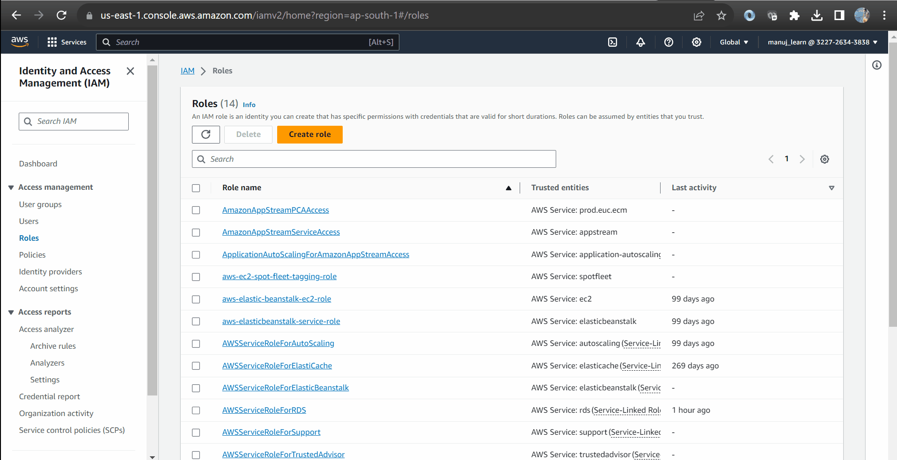
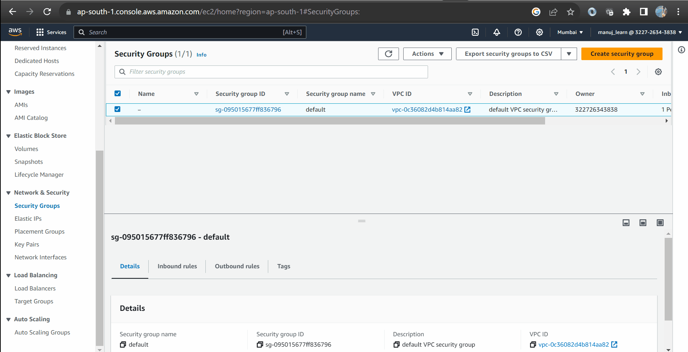

# jenkins-aws-architecture-files

### Steps for setting up production grade CICD pipeline using Jenkins for frontend applications

1. Login to your AWS account and create an S3 bucket and a distribution on cloudfront.<br/>
2. Create an IAM **user access key** which will be used by build server to promote the build artefact to s3 and also to automate cloudfront invalidations. Store it at some temporary location because this will be visible only once.<br />
3. Create an IAM role for build server which will be hosted on an ec2 instance and will use this role access the Cloudfront and S3 services automatically. The role will require a **policy** to access the desired services.
4. Create a policy and attach the policy to the role. Please find the rules of the policy in [**this file.**](docs/build-server-policy.txt)
5. Navigate to your EC2 dashboard and create a key pair for your jenkins master server and build servers(i.e. the servers responsible for hosting CICD pipeline settings, building and deploying your changes).
6. Create security group for you master server
   a. Inbound rule can vary but usually contain an SSH rule, along with HTTP and HTTPS if required.
   b. Outbound rule is always public.
7. Create security group for build server
   a. Inbound rule will be SSH from you master server when we're configuring SSH agents. You can also add another SSH from your account.
   b. Outbound rule will be default i.e. public<br />
8. Launch an EC2 instance for master server. I used ubuntu for my master server and Amazon Linux for my build server.
9. SSH into your jenkins master EC2 instance:

- Type in the command:</br>

```bash
   ssh -i /path/to/your/keypair.pem ubuntu@public.IP.address.of.your.instance # Here ubuntu is the default username of the instance
   sudo su - # for promoting yourself as sudo user.
   vim install.sh # create a shell script file where the installation will be placed.
   source install.sh # to execute the the shell script
```

- The contents of the `install.sh` can be copied from [**this file**](docs/install.sh).

10. Now you can launch the second EC2 instance i.e. build server with following configurations.

    - Provide the role to this EC2 instance as per point number 3.
    - Provide the security group, key pairs as per point number 5 and point 6.
    - Copy and paste the user data script from [**this file.**](docs/build-server-script.sh)

11. After the jenkins is setup and ready to be used:

    - Remove the build executor for jenkins master server. We'll be using the executors from build-server since we're especially configuring it for the similar purpose.
    - Add AWS pipeline steps and AWS credentials plugins.<br />
    - Add two credentials in Jenkins global.
      - **EC2-user**: This credential will be of type SSH and you need to paste the RSA key that you downloaded from point number 5.
      - **aws-creds**: The credential that you created in point number 2.
    - Add a new executor node as per the gif attached below.<br/>
    - If `/tmp` directory low in space issue arises please [**refer to this file for fix.**](docs/tmp-low-space-fix.md)

12. Create a new pipeline project with configurations and add a webhook to your github repo as shown in the attached gif above.
